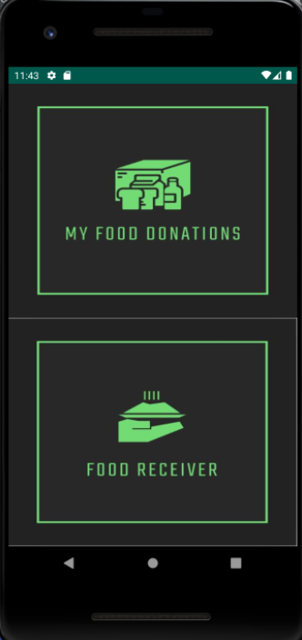
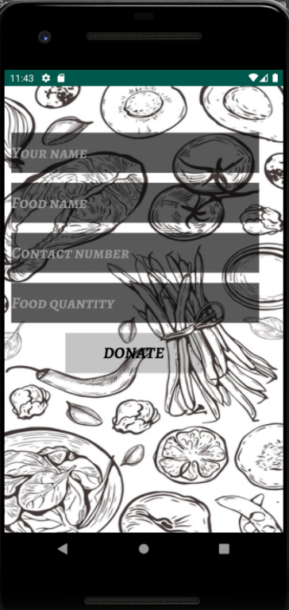
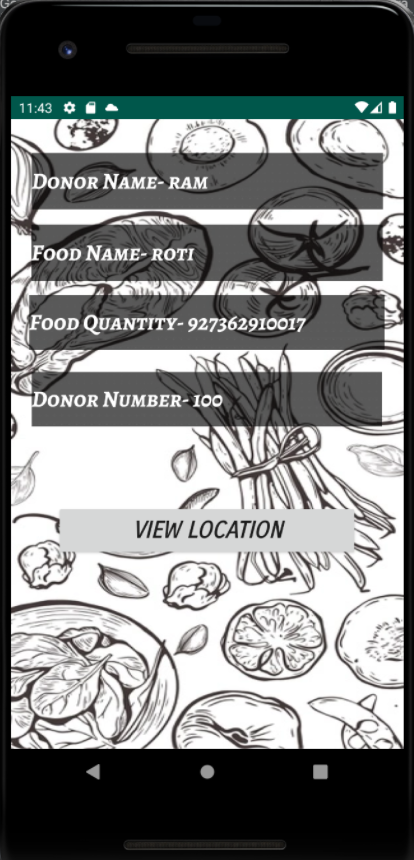
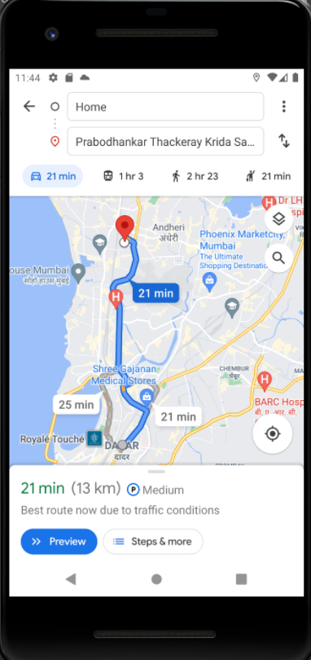
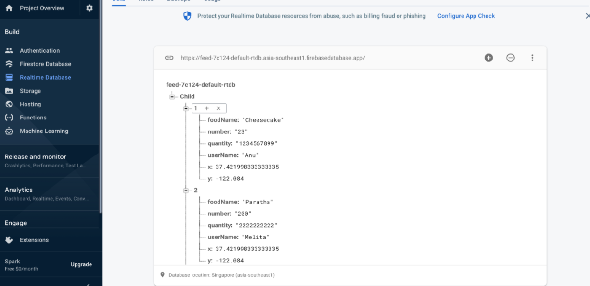

# Feed
## Main Activity 
### 
This file is the first page that displays to the user where our logo is displayed across the screen and it’s XML file is made using constraint layout 

## First Activity
### 
Here the user can sign in into their respective account. They also have the option of signing up incase they do not possess login credentials. The respective XML file is made using Constraint layout. If the user clicks the signup button they will be taken to a new page
When the user successfully signs in it takes the user to the activity_second.xml life which is made using linear layout

## Register Activity
### 
Here the user can input their email and password and register their account into our authentication database. With these credentials they can use our account. The XML page is made using linear layout 

## Second Activity
### 
Here users are given the option to donate or recieve food

## Donate Activity
### 
This Java file takes the name, number , food quantify as well as the users latitude and longitude and stores it on the firebase database using the donate button. It’s respecting XML file is made using relative layout 

## Revieve Activity
### 
This file calls the database to display the food items users are donating on the screen for other users too see.

## Display Activity
### 
This file takes the donor name, number, food quantity and location from the database and displays it for the user to see. It’s respective XML file is made using constraint Layout 

## Geolocation
### 
With the help of this file the location of the user is captured and stored in the database and displayed when the user wants to collect food from a donator

## Database(Firebase)

